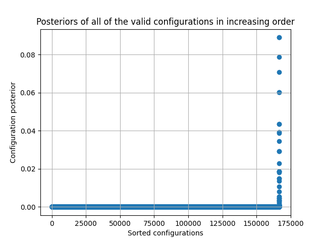
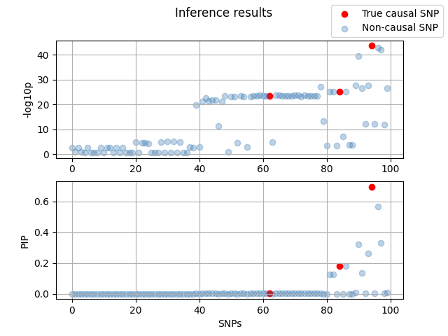

# Introduction

For a phenotype of interest, we have identified a GWAS locus based on $N=498$ individuals, which harbour 100 SNPs. The causal SNPs are highlighted as `rs10104559`, `rs1365732`, `rs12676370`.

The marginal z-score and LD matrix from here:

https://drive.google.com/drive/folders/1NsvBrWQaCcwLXaAcq2CRhcgGc9JxzhAO?usp=sharing

# Solution

1. Implement the efficient Bayes factor for each causal configurations

$$BF(\gamma:NULL) = \frac{\mathcal{N}(\hat{\mathbf{z}}_c \vert \mathbf{0}, \mathbf{R}_{CC} + \mathbf{R}_{CC} \Sigma_{CC} \mathbf{R}_{CC})}{\mathcal{N}(\hat{\mathbf{z}}_c \vert \mathbf{0}, \mathbf{R}_{CC})}$$

2. Implement the prior calculation for each configurations

$$p(\gamma) = \left( \frac{1}{m} \right)^k \left( \frac{m-1}{m} \right)^{m-k} $$

3. Implement posterior inference over all possible configurations assuming at maximum 3 causal SNPs

$$p(\gamma \vert \mathbf{z}, \mathbf{R}) = \frac{BF(\gamma:NULL)p(\gamma)}{\sum_{\gamma \prime} BF(\gamma \prime:NULL)p(\gamma \prime)}$$

4. Implement posterior inclusion probabilities (PIP) to calculate SNP-level posterior probabilities

$$p(\gamma_j = 1 \vert \mathbf{z}, \mathbf{R}) = \frac{\sum_{\gamma} \mathbb{I}[\gamma_j = 1] p(\gamma \vert \mathbf{z}, \mathbf{R})}{\sum_{\gamma} p(\gamma \vert \mathbf{z}, \mathbf{R})}$$

# Result

Visualize the configuration posteriors by ranking them in increasing order. As we can see, the vast majority of the configurations have very small posterior probabilities.

Visualize the normalized inferred PIP aligned with GWAS marginal -log10 p-values. It looks like we missed one of the 3 causal SNPs due to its nearly perfect LD with the other causal SNPs. But in general, we are able to pull down quite a few non-causal ones. That is, if we were going to experimentally validate the top SNPs, 2 out of 6 top SNPs based on PIP are true causal ones, whereas we would have got a lot more false positives if we were to follow the -log10 P-values instead.

